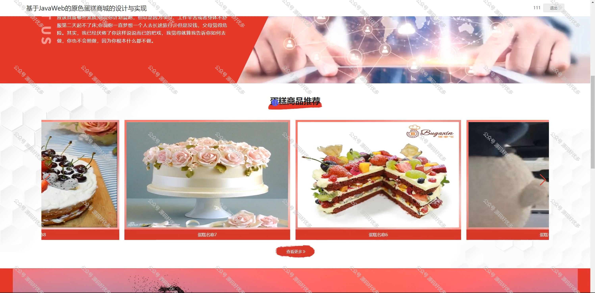

 
## 查看主页获取源码

### 一、作品包含

源码+数据库+设计文档万字+PPT+全套环境和工具资源+部署教程

### 二、项目技术

前端技术：Html、Css、Js、Vue、Element-ui

数据库：MySQL

后端技术：Java、Spring Boot、MyBatis

  

### 三、运行环境

开发工具：IDEA/eclipse

数据库：MySQL5.7

数据库管理工具：Navicat10以上版本

环境配置软件： JDK1.8+Maven3.6.3

前端Nodejs：14

### 四、项目介绍
项目编号：springbootA232

原色蛋糕商城，以其对糕点艺术的独特理解和高品质的产品理念，在烘焙行业中崭露头角。商城以追求自然、健康的生活态度为出发点，致力于为消费者提供一系列精致美味的蛋糕，旨在将甜蜜与幸福融入每一个重要时刻，成为人们庆祝生活、表达情感的温馨选择。

前台用户功能：浏览首页、蛋糕商品、公告资讯、购物车、客服中心和个人中心。

后台管理员的功能：系统首页、个人中心、用户管理、蛋糕分类管理、蛋糕商品管理、补货信息管理、系统管理和订单管理。

### 五、运行截图

  
